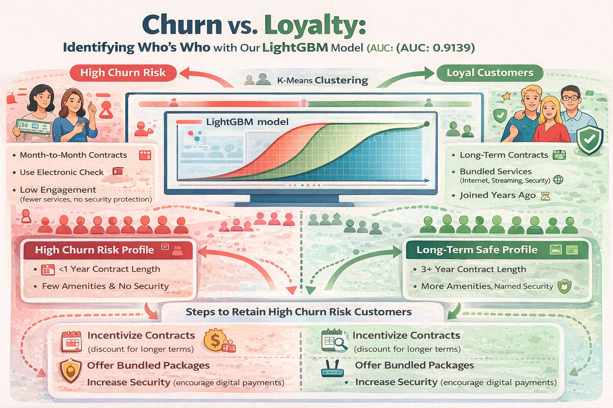

# Customer Churn Prediction — Machine Learning Pipeline

    

## Project Goal

Develop a machine learning system capable of predicting customer churn for a telecommunications provider, enabling businesses to proactively identify at-risk customers and implement targeted retention strategies.

---

## Dataset

The dataset combines multiple sources containing:

• Customer demographic information  
• Contract details  
• Internet service subscriptions  
• Phone service usage  
• Billing and payment methods  

All datasets were merged using CustomerID to create a unified analytical dataset.

---

## Data Preparation

Key preprocessing steps included:

• Merging multiple relational datasets  
• Handling missing values  
• Encoding categorical variables  
• Converting date fields and numeric features  
• Creating the churn target variable  
• Removing non-predictive identifiers  

This process produced a clean feature set suitable for machine learning modeling.

---

## Exploratory Data Analysis

EDA revealed several strong predictors of churn:

• **Contract Length**  
Month-to-month contracts showed significantly higher churn rates.

• **Payment Method**  
Electronic check payments correlated with elevated churn risk.

• **Customer Tenure**  
Newer customers were substantially more likely to churn.

• **Service Engagement**  
Customers with additional services (security, backup, streaming, tech support) demonstrated higher retention rates.

---

## Model Development

Several classification models were trained and compared:

• Logistic Regression (baseline model)  
• LightGBM Gradient Boosting  
• CatBoost Gradient Boosting  

Hyperparameter tuning was performed using parameter grids to optimize model performance.

---

## Model Evaluation

Models were evaluated using:

### Primary Metric
• AUC-ROC

### Validation Strategies
• Time-based (chronological) split  
• Random shuffled split  

The shuffled split produced stronger and more stable generalization results.

---

## Final Model

**Model:** LightGBM Classifier  

**Performance**
• AUC-ROC: **0.9139**

This exceeded the project benchmark of **0.88**, demonstrating strong predictive capability.

---

## Customer Segmentation

K-Means clustering was used to segment customers into behavioral groups based on:

• tenure  
• spending patterns  
• service adoption  

This analysis revealed two major segments:

• High-engagement long-term customers (lower churn risk)  
• Lower-engagement newer customers (higher churn risk)

---

## Business Impact

This model enables organizations to:

• Identify high-risk customers early  
• Prioritize retention campaigns  
• Improve customer lifetime value  
• Allocate marketing resources efficiently  

Additionally, insights from the analysis suggest retention strategies such as:

• incentivizing longer contracts  
• promoting bundled services  
• encouraging early adoption of add-on services

---

## Tech Stack

### Languages
• Python

### Libraries
• Pandas  
• NumPy  
• Scikit-Learn  
• LightGBM  
• CatBoost  
• Matplotlib / Seaborn

### Methods
• Feature Engineering  
• Hyperparameter Tuning  
• Gradient Boosting  
• AUC-ROC Evaluation  
• K-Means Clustering

---

## Key Skills Demonstrated

• Machine Learning Modeling  
• Feature Engineering  
• Model Evaluation & Validation  
• Hyperparameter Optimization  
• Business-Driven Data Science

---

## Outcome

A production-ready churn prediction model with strong generalization performance capable of supporting real-world retention decision making.