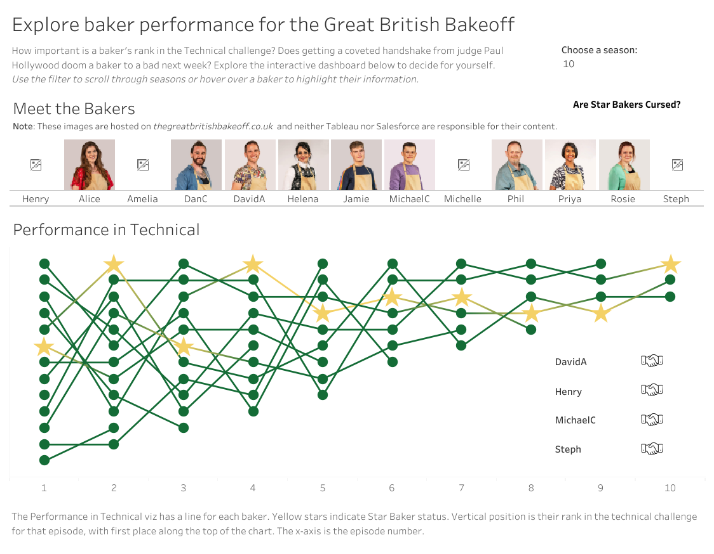
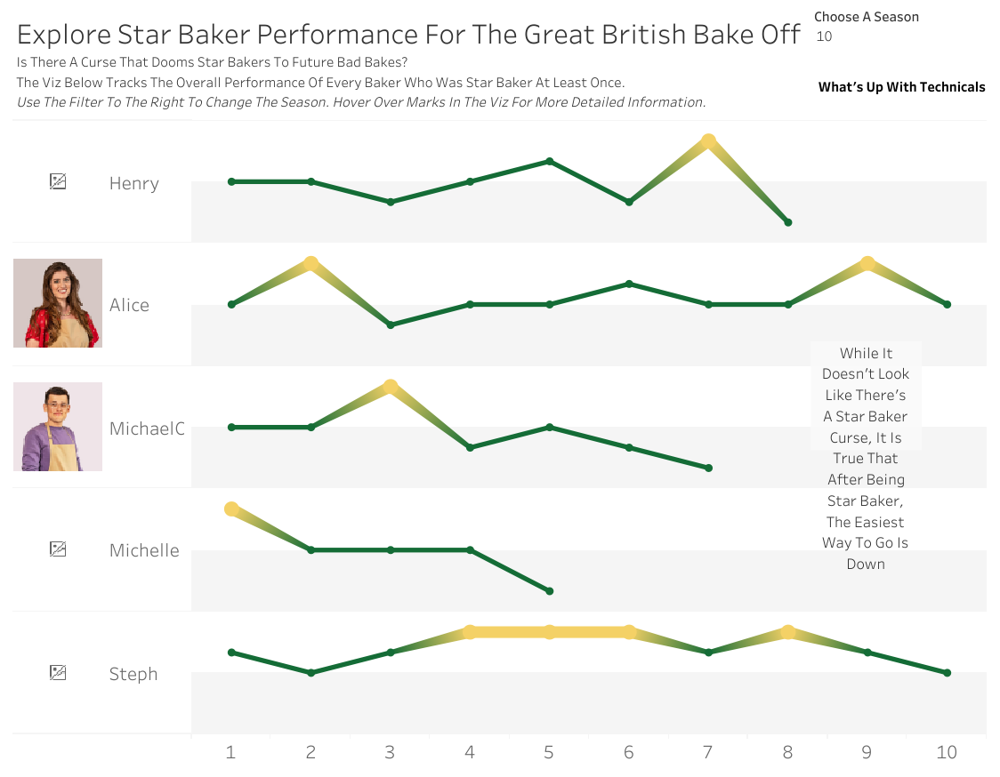

# Great British Bake Off Dashboard Analysis

## Overview
This Tableau project explores baker performance across episodes and investigates whether receiving Star Baker status impacts future results. The dashboards focus on technical challenge rankings, contestant consistency, and the so-called “Star Baker curse.”

## Interactive Dashboard

**View the full interactive dashboard here:**

🔗 https://public.tableau.com/app/profile/ivey.nixon/viz/MyFirstDashboardOnTableauPublic_17734310280080/BakerPerformance?publish=yes

*Note: Preview images are shown below, but the full experience is interactive on Tableau Public.*

## Dashboard Previews

### Baker Performance

  

### Star Baker Performance

  

## Project Goals
- Analyze baker performance across episodes
- Compare technical challenge rankings over time
- Explore whether Star Baker winners decline in later episodes
- Create an interactive dashboard for exploratory analysis

## Tools Used
- Tableau Public
- Data Visualization
- Interactive Dashboard Design
- Exploratory Data Analysis

## Key Insight
The dashboards suggest that while there is no clear “Star Baker curse,” performance often becomes harder to maintain after earning Star Baker recognition.

## Files
- `Images/` → dashboard preview images
- `README.md` → project summary and Tableau link
