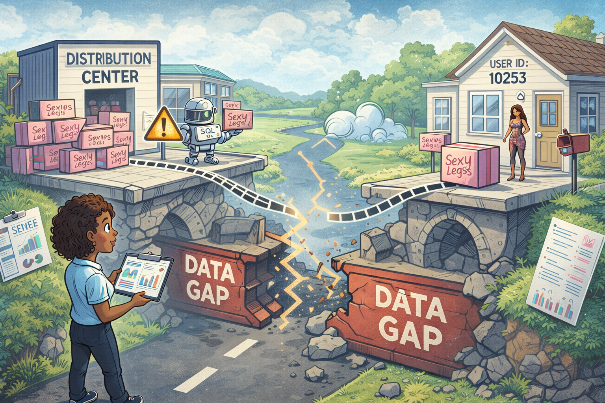

# 🧮 Sexy Legs SQL Project

This project began with a simple question:

**Can we track a product from distribution… all the way to the customer?**

Using the “Sexy Legs” product line from an e-commerce dataset, the goal was to explore how inventory, orders, and user activity connect across multiple tables—and whether a full pipeline could be reconstructed.

---

The analysis started at the source: distribution centers.

By aggregating inventory data, we were able to calculate:
- 📦 Inventory counts across locations  
- 💰 Total inventory cost  
- 📈 Potential revenue and profit  
- ✅ Realized sales and profit  

From there, we drilled into individual sold items—capturing product IDs, names, costs, retail prices, timestamps, and their originating distribution centers. This gave us a clear picture of what was sold and where it came from.

---

Next came order behavior.

We analyzed order statuses across the system:
- Complete ✅  
- Processing 🔄  
- Shipped 📦  
- Cancelled ❌  
- Returned ↩️  

This revealed how orders move through the pipeline—but not necessarily how they connect back to inventory.

---

Then we shifted focus to user activity.

By analyzing event data, we captured:
- 🌐 Session-level interactions  
- 🧍 User IDs  
- 📍 Geographic data (city, state, postal code)  
- 🚦 Traffic sources  

This allowed us to measure **intent**—how often users interacted with “Sexy Legs” products and where that interest was coming from.

---

At this point, the goal became clear:

**Connect everything.**

Inventory → Orders → Events → Users

---

We attempted to join datasets using:
- product_id  
- user_id  
- timestamp proximity  

And while partial matches were possible, only **~23 records** could be confidently linked within a reasonable time window.

---

That’s when the real insight emerged.

Despite having rich datasets, there is:

> ❌ No reliable shared key that connects the full lifecycle of a product

We cannot definitively trace a single item from:
- 📦 Distribution center  
→ 🛒 Order  
→ 🚚 Delivery  
→ 🧍 Customer  

Because:
- Product IDs are reused across multiple records  
- Event data and order data lack a direct relationship  
- Timestamp matching is approximate, not exact  

---

Instead of forcing inaccurate joins, the analysis shifted toward **defensible insights**:

- ✅ Measuring inventory and profitability at the distribution level  
- ✅ Understanding order outcomes and system behavior  
- ✅ Analyzing user intent through traffic and session data  
- ❌ Acknowledging the limitation in end-to-end traceability  

---

This project demonstrates more than SQL proficiency.

It shows the ability to:
- 🧠 Validate data relationships before drawing conclusions  
- 🔗 Work with joins, subqueries, and aggregations  
- 🪟 Use window functions for deeper insight  
- 🧼 Clean and structure data for analysis  
- ⚖️ Recognize and document data limitations  

---

In the end, the most important takeaway wasn’t just what the data revealed…

…but what it **couldn’t**.

Some pipelines flow cleanly.

Others break in silence.

And sometimes, the most valuable insight is simply noticing the gap.
