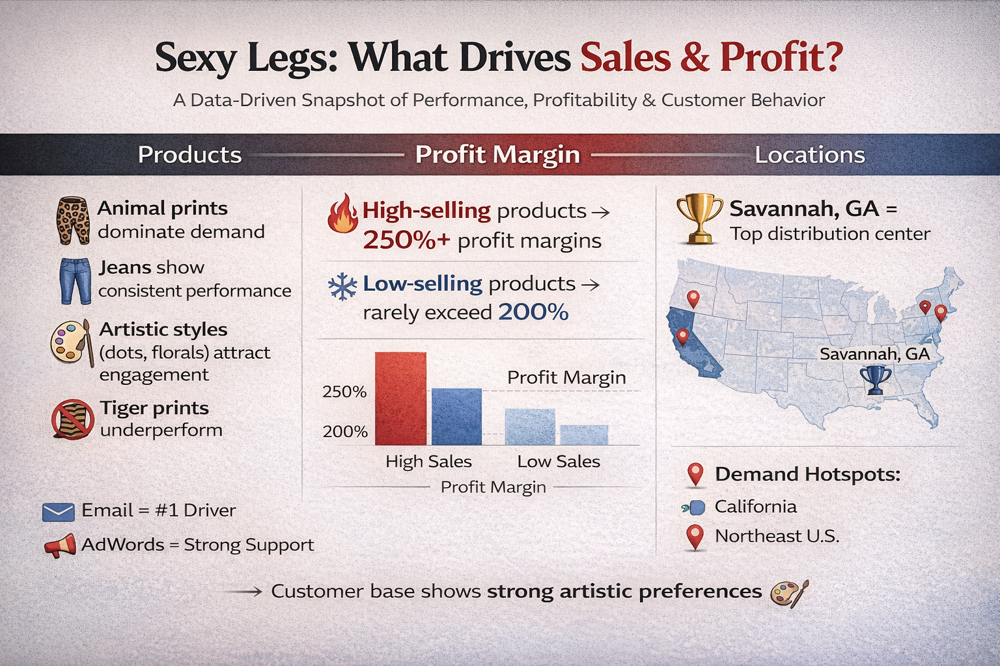

# Sexy Legs: Product Performance & Profitability Analysis

## 📊 Project Overview
This project analyzes product performance for "Sexy Legs" across multiple distribution centers, focusing on sales volume, profit margins, and customer traffic sources.

The goal is to identify:
- Which products perform best
- How profitability varies across locations
- Where customer demand is coming from
- What factors drive high-performing products

---

## 🖼️ Project Preview

---

## 🎯 Key Questions
- Which products generate the highest profit margins?
- Do higher-selling products also yield higher profitability?
- How does performance vary across distribution centers?
- What traffic sources drive the most engagement and sales?

---

## 📈 Key Insights

### 🚀 High Performance = High Profit
- Products sold **7+ times** consistently show **250%+ profit margins**
- Products sold **≤5 times** rarely exceed **200% profit margins**
- Top-selling products are also the most profitable

---

### 🎯 Winning Product Styles
- Animal prints (Cheetah, Bobcat) dominate performance
- Jean styles show consistent demand
- Dot & watercolor patterns attract strong engagement
- Bold, expressive designs outperform basic styles

---

### 📍 Top Performing Location
- **Savannah, GA** stands out as the strongest distribution center
- Higher profit margins across multiple products
- Strong alignment between demand and profitability
- Functions as a high-efficiency hub

---

### 📡 Traffic Source Insights
- **Email** is the most consistent driver of traffic
- AdWords and Facebook vary depending on the product
- No single channel dominates across all top sellers
- Marketing success depends on product-channel fit

---

### 🌎 Customer Behavior Insight
- Demand clusters are strongest in:
  - California
  - Northeast U.S.
- Regions with stronger artistic culture show higher engagement

---

## 🧠 Tools & Technologies
- Tableau Public (Data Visualization & Storytelling)
- CSV datasets (Product, Sales, Traffic data)
- Data blending and filtering techniques
- Interactive dashboards and story points

---

## 📂 Project Structure
- `images/sexylegsinterest.png` → Dashboard preview image
- `Tableau Workbook (.twbx)` → Full interactive dashboard & story
- `CSV Files` → Raw datasets used for analysis
- `README.md` → Project documentation

---

## 🔗 Tableau Public Link
[View Interactive Dashboard](https://public.tableau.com/app/profile/ivey.nixon/viz/SexyLegsProductPerformanceProfitabilityAnalysis/Story1)

---

## 💡 Reflection
This project represents an end-to-end data analysis process:
from raw data exploration to building an interactive story.

It emphasizes not just technical skills, but the ability to:
- Extract meaningful insights
- Communicate findings clearly
- Structure data into a narrative

---

## 🚀 Next Steps
- Improve dashboard design and visual clarity
- Add advanced analytics (segmentation, forecasting)
- Expand analysis with additional datasets
